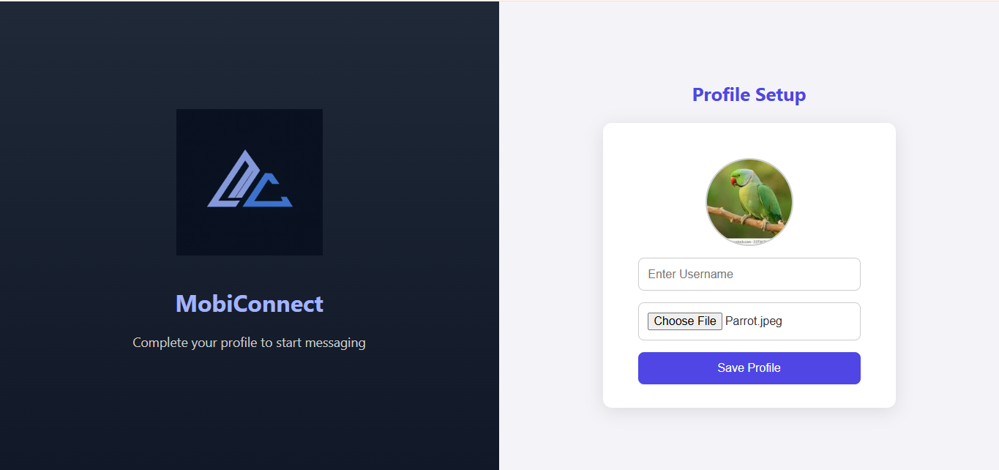

# MobiConnect

MobiConnect is a web-based platform designed for people to connect, communicate, and collaborate around shared interests. Users can create or join rooms for various topics, share their thoughts through messages, images, and files, and even initiate video meetings within those rooms.

Whether it's one-on-one conversations or interest-based group chats with video calls and screen sharing, MobiConnect provides a unified, secure, and intuitive environment for meaningful interactions.

---

##  Live Demo

A full walkthrough demo is available for recruiters and reviewers:

**YouTube Demo (Unlisted):** [Watch Here](https://www.youtube.com/watch?v=F8JFgLfoCcM)

---

##  Features

- **User Authentication:** Sign up via email or Google.
- **Profile Setup:** Add a username and profile picture after signup.
- **One-on-One Chats:** Real-time messaging with individual users.
- **Group Rooms:** Create or join interest-based rooms for group messaging.
- **Media Sharing:** Send images, files, and documents in both private and group chats.
- **Video Calling:** Start 1:1 or group video calls with screen sharing.
- **Participants View:** See a list of members in a group.
- **Dark Mode UI:** Minimal, accessible, and modern interface.

---

##  Tech Stack

**Frontend:**
- React
- Tailwind CSS
- Socket.IO Client

**Backend:**
- Node.js
- Express.js
- MongoDB
- Socket.IO
- Mediasoup (WebRTC-based video communication)

---

##  Screenshots

### 1. User Login


### 2. User Registration


### 3. Profile Setup


### 4. Group Chat & Image Sharing


### 5. Group Participants View


### 6. View Profile Picture
Users can click on profile pictures to see a larger version.


### 7. File Sharing & Incoming Call


### 8. Group Video Call


---

##  How to Run Locally

1. First, clone the repository to your machine using `git clone`.
2. Go into the root folder and open two terminal windows/tabs — one for the backend and one for the frontend.
3. In the **server** folder:
   - Navigate to the `server` directory.
   - Run `npm install` to install all backend dependencies.
   - Then run `npm run dev` to start the backend server.
4. In the **client** folder:
   - Navigate to the `client` directory.
   - Run `npm install` to install all frontend dependencies.
   - Then run `npm run dev` to start the frontend React app.
5. Open your browser and visit `http://localhost:5173` to use the application locally.

Make sure MongoDB is running locally or adjust the connection string to your cloud instance (like MongoDB Atlas) if you're using one.

---

###  Environment Setup

Before running the app, make sure you create the following environment files:

#### `client/.env`

```env
VITE_GOOGLE_API_KEY=your_google_api_key  
VITE_GOOGLE_PROJECTID=your_google_project_id  
VITE_GOOGLE_APP_ID=your_google_app_id  
VITE_GOOGLE_AUTH_DOMAIN=your_google_auth_domain  
```

#### `server/.env`

```env
MONGODBURI=your_mongodb_connection_string  
SECRET_KEY=your_secret_key  

CLOUDINARY_CLOUD_NAME=your_cloudinary_cloud_name  
CLOUDINARY_API_KEY=your_cloudinary_api_key  
CLOUDINARY_API_SECRET=your_cloudinary_api_secret  
```

#### `ServiceAccount.json`

Place your `ServiceAccount.json` file in the root `MobiConnect/` directory.

>  This file is required for Firebase or Google Cloud services. Be sure to add it to `.gitignore` to avoid committing sensitive information:

```gitignore
/ServiceAccount.json
```

---


##  Contact

Feel free to connect if you have any questions or feedback:

- **Email:** bhatiajatin974@gmail.com
- **LinkedIn:** [Jatin Bhatia](https://www.linkedin.com/in/jatin-bhatia-4653042aa/)
